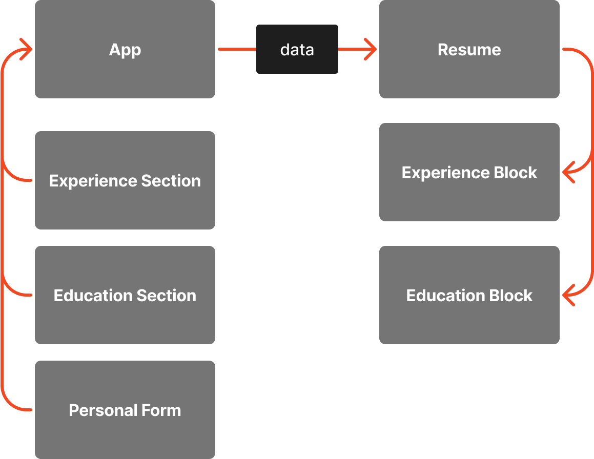
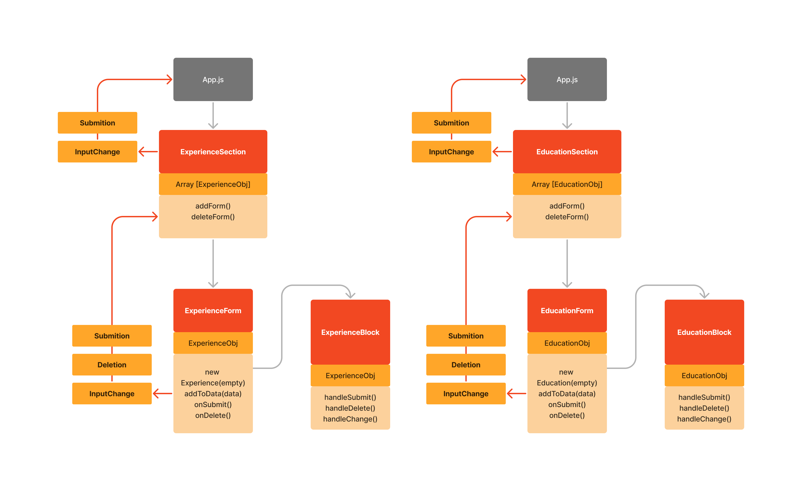

# React CV Creator App
This app is based on React.js. It gets information from users and displays it on Resume component.

## Functionality

The app consits of 2 parts:
- Aside menu (including forms)
- Resume component

### Aside
Aside bar contains 3 sections:
- Personal form
- Education section
- Experience section

Forms are based on `useState` hook. 

#### Personal form
Personal form is a functional component based on `React.js`. It uses `useState` hook to keep and updated information about user's personal info in Resume functional component. It handles submition and parses data App component.

#### Education and Experience sections
Education and Experience sections are functional based on `React.js`. It uses `useState` hook to keep and updated information about user's education and experience, and keep array of forms added to the section. It handles deletion of inner forms: `EducationForm` and `ExperienceForm`, their submition and input change. It parses data to App component.

#### Clear all button

### Resume
Resume is a functional component based on `React.js`. It displays data updated and parsed from forms.
